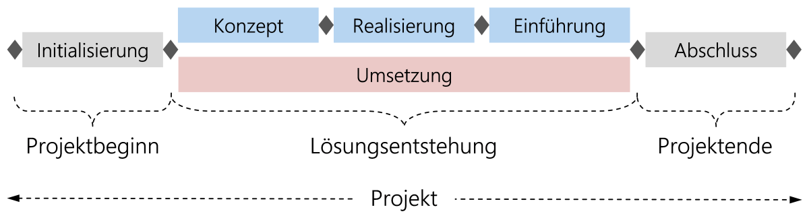
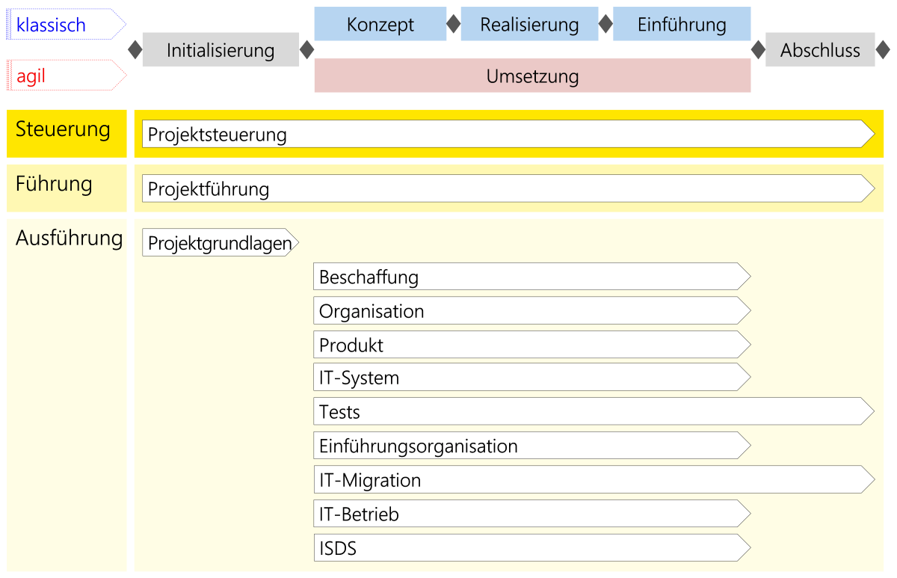
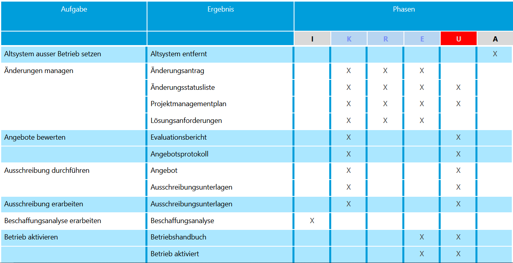
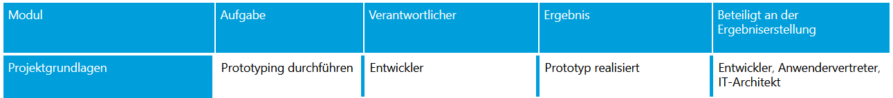
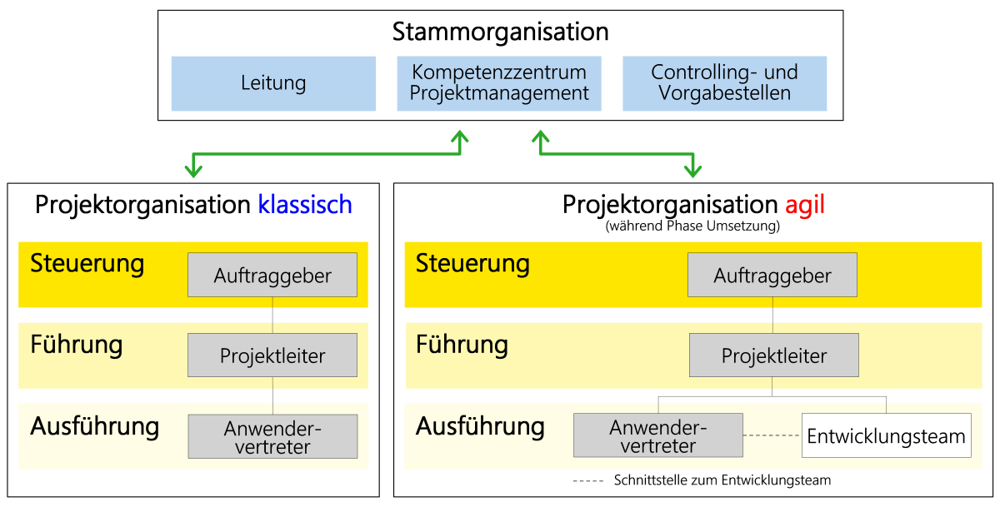
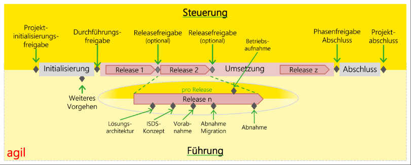

# Hermes

## Was ist Hermes?
Die Projektmanagementmethode "Hermes" ist eine Schweizer Projektmanagmentmethode, die in der öffentlichen Verwaltung sowie in anderen Branchen angewendet werden kann. Der Name steht als Akronym für „Handbuch der Elektronischen Rechenzentren des Bundes, eine Methode zur Entwicklung von Systemen“. 

Sie wurde von der schweizerischen Bundesverwaltung 1975 entwickelt, steht als offener Standard frei zur Verfügung und ist als Standard eCH-0054 vom Verein eCH anerkannt.

Die Methode wird kontinuierlich verbessert und geupdated.
Der Bund bietet dazu Online sehr viele Informationen an:

https://www.hermes.admin.ch/

---

Die Methode besteht aus einem umfassenden Handbuch, das verschiedene Aspekte des Projektmanagements abdeckt. Zu den wichtigsten Merkmalen von Hermes gehören: 

1.  **Strukturierte Phasen:**

    Hermes teilt das Projekt in Phasen ein, die von der Initialisierung bis zur Umsetzung reichen. Jede Phase wird sorgfältig geplant und dokumentiert, um sicherzustellen, dass das Projekt erfolgreich abgeschlossen wird. Die neuste Hermes Variante unterstützt Phasen für die agile Projektführung, wie auch die klassische Variante.

    

    Innerhalb der einzelnen Phasen werden Module eingesetzt, welche einzelne Teilschritte des Projekts darstellen. Phasen stellen den Projektfortschritt dar. Einzelne Module (wie zb. das Standardmodul [Projektführung](https://www.hermes.admin.ch/de/pjm-2022/verstehen/module/projektfuehrung.html)) können dabei in mehreren Phasen auftreten.

2. **Module:**

    Module enthalten thematisch zusammengehörende Aufgaben und Ergebnisse. Sie sind Bausteine zur Erstellung von Projekten und Szenarien. Das Modul Projektführung enthaltet zum Beispiel die Aufgabe 
    [Qualitätssicherung führen](https://www.hermes.admin.ch/de/pjm-2022/verstehen/aufgaben/qualitaetssicherung-fuehren.html). Aufgaben werden im nächsten Punkt genauer beschrieben. Diese Aufgaben führen immer zu Ergebnissen.

    
    
    Hermes biete eine Vielzahl von Standardmodulen, welche individuell angepasst werden können, oder sogar durch komplett eigene Module ersetzt werden können.

3. **Aufgaben & Ergebnisse:**

    Aufgaben sind bestimmten Rollen zugeteilt und werden immer mit Ergebnissen in Verbindung gebracht. Eine Aufgabe kann mehrere Aktivitäten beinhalten. Aufgaben dienen zur Bündelung in logische Schritte, aus einzelnen Aktivitäten wie zb. *Altsystem oder alte Systemversion ausser Betrieb setzen.* 
    
    Verbindet man diese Aktivität nun mit der Aktivität *Altsystem abbauen.*, ergibt dies die **Aufgabe** *Altsystem ausser Betrieb setzen*, mit dem Ergebniss *Altsystem entfernt*

    

    Ergebnisse sind entweder neue Zustände der Situation, wie im vorherigen Beispiel, oder aber Dokumente, welche vorrausgehend mit einer Vorlage definiert worden sind.

    Diese Dokumente sind zb. Testprotokolle, ein Durchführungsauftrag, eine Studie, eine Checkliste oder eine Prozessbeschreibung. Diese Liste ist nicht abschliessend.

4. **Rollen und Verantwortlichkeiten:** 

    Hermes definiert klare Rollen und Verantwortlichkeiten für alle Projektbeteiligten, einschließlich des Projektmanagers, des Projektteams und der Stakeholder. 

    Jede Aufgabe hat einen Verantwortlichen, mit einer spezifischen Rolle. Dieser Verantwortliche ist dafür zuständig, dass die definierten Ergebnisse erreicht werden. Dazu können aber auch noch andere Rollen miteinbezogen werden, sodass eine bestimmte Aufgabe von mehreren Rollen bearbeitet werden kann.

    

    Hier zum Beispiel sieht man gut, dass der Entwickler dafür verantwortlich ist, dass ein Prototyp realisiert wird. Für diese Aufgabe muss aber der IT-Architekt und der Anwendervertreter miteinbezogen werden, da diese massgeblich dazu beitragen müssen, dass der Prototyp in die jetzige IT-Architektur eingebunden wird (falls möglich) und von den Anwendern geforderte Anforderungen korrekt umgesetzt werden.

    Die einzelnen Rollen werden in einem hierarchischen Rollenmodell definiert. Dieses Modell ist nicht relevant für die Aufgaben / Module, bietet aber eine Übersicht.

    

    Die Unterteilung in Stammorganisation und Projektorganisation dient der Visualisierung der effektiven Abtrennung des Projekts von der Unternehmerischen Führung. Verbindungspunkte bestehen und Unternehmungsführungspersonen können auch direkt als Stakeholder in das Projekt eingegliedert werden.

## Was kann Hermes?

#### Vorteile:

1. Standardisiertes Vorgehen: 
    HERMES bietet ein strukturiertes und standardisiertes Vorgehen für Projektmanagement, was dazu beiträgt, dass Projekte effizient und zielorientiert durchgeführt werden können.

2. Flexibilität:
    HERMES ist eine flexible Methode, die auf die Bedürfnisse des Projekts angepasst werden kann. Es bietet verschiedene Vorgehensmodelle und Phasen, die je nach Projekt unterschiedlich eingesetzt werden können.

3. Klare Rollen und Verantwortlichkeiten:
    HERMES definiert klare Rollen und Verantwortlichkeiten für die Projektbeteiligten, was dazu beiträgt, dass das Projektteam effektiv zusammenarbeiten und das Projektziel erreichen kann.

#### Nachteile:

1. Komplexität:
    Die HERMES-Methode kann für unerfahrene Projektmanager oder für kleine Projekte als zu komplex empfunden werden.

2. Dokumentationsaufwand:
    Die HERMES-Methode legt großen Wert auf Dokumentation und Berichtswesen, was für manche Projekte einen höheren Aufwand bedeutet.

3. Begrenzte Anpassung:
    Obwohl HERMES flexibel ist, kann es schwierig sein, die Methode für bestimmte Projekte oder Branchen anzupassen, da sie ursprünglich für die Verwaltung von IT-Projekten entwickelt wurde.

### Einsatzzweck von Hermes

HERMES ist eine Projektmanagement-Methode, die in der Schweiz entwickelt wurde und auch in anderen Ländern eingesetzt wird. Die Methode hat ihren Schwerpunkt auf der Durchführung von IT-Projekten, kann aber auch für andere Arten von Projekten angewendet werden.

Der Einsatzzweck von HERMES besteht darin, eine strukturierte und standardisierte Vorgehensweise für die Planung, Durchführung und Kontrolle von Projekten zu bieten. Durch die klare Definition von Rollen, Verantwortlichkeiten und Prozessen soll sichergestellt werden, dass Projekte effektiv und effizient durchgeführt werden und die Projektziele erreicht werden können. HERMES bietet dabei eine hohe Flexibilität, sodass die Methode je nach Projektart und Projektumfang angepasst werden kann.

Insgesamt eignet sich HERMES insbesondere für komplexe Projekte mit vielen Beteiligten und einem hohen Risiko- und Veränderungsmanagementbedarf. HERMES stellt sicher, dass Projekte transparent und nachvollziehbar durchgeführt werden und so ein hoher Projekterfolg erzielt wird.
		
## Wie geht man mit Hermes vor?

Bei Hermes gibt es zwei unterschiedliche Methoden zur effektiven Umsetzung, die klassische Methode und die agile Methode.

### Klassisch

1. Initiation:

    In dieser Phase wird das Projekt initialisiert. Das bedeutet, dass das Projektziel, der Projektauftrag, die Rahmenbedingungen und die Projektorganisation festgelegt werden.

2. Konzeption:

    In dieser Phase wird das Projektkonzept ausgearbeitet. Das bedeutet, dass das Lasten- und Pflichtenheft erstellt wird, die Risiken identifiziert werden und das Projektbudget festgelegt wird.

3. Realisierung:

    In dieser Phase wird das Projekt umgesetzt. Das bedeutet, dass das Projektteam die Arbeitspakete und Meilensteine festlegt, die Aufgaben verteilt und die Arbeit durchführt.

4. Einführung:

    In dieser Phase wird das Projekt implementiert. Das bedeutet, dass die Ergebnisse des Projekts in Betrieb genommen werden, Schulungen durchgeführt werden und eine Support-Organisation aufgebaut wird.

5. Abschluss:

    In dieser Phase wird das Projekt abgeschlossen. Das bedeutet, dass eine Abschlussdokumentation erstellt wird, die Ergebnisse bewertet und die Projekterfahrungen dokumentiert werden.

Mit diese Methode werden Meilensteine abgearbeitet.

### Agil

1. Initiation:

    In dieser Phase wird das Projekt initialisiert. Das bedeutet, dass das Projektziel, der Projektauftrag, die Rahmenbedingungen und die Projektorganisation festgelegt werden.

2. Umsetzung:

    Die Umsetzungsphase, fässt als Agile-Methode die 3 Phasen "Konzeption,Realisierung und Einführung" zusammen.
    Die Lösungsanforderungen werden weiter aufgeteilt, verfeinert und konkretisiert. Die Anforderungen werden aktualisiert und priorisiert und nach absteigender Priorität abgearbeitet (entwickelt, realisiert und in Betrieb genommen), wobei die Prioritäten kontinuierlich aktualisiert und den Projekterkenntnissen entsprechend angepasst. Dadurch wird das ganze Projekt agiler.

3.  Abschluss:

    In dieser Phase wird das Projekt abgeschlossen. Das bedeutet, dass eine Abschlussdokumentation erstellt wird, die Ergebnisse bewertet und die Projekterfahrungen dokumentiert werden.

Mit dieser Methode wird mit Releases und Releasefreigaben gearbeitet.

 

		
### Praxisbeispiel

[Am 26. April 2006 wurde das Projekt Quapital (QUAlité des Projets d'Implémentation des Technologies de l'information et de la communication dans l'Administration Luxembourgeoise) der Regierung von Luxemburg vorgestellt. Das Ziel vom Teilbereich Quapital Werkzeuge ist es konsistente Daten auf allen Ebenen (Projekt, Programm und Portfolio) zu erhalten. Dieses Tool basiert vollständig auf Quapital-Hermes.](https://de.wikipedia.org/wiki/Hermes_(Projektmanagementmethode))

## Abschluss

Hermes ist ein interessantes Projektmanagment, welches ich persönlich schon länger kennenlernen wollte. Diese Möglichkeit hat sich mir jetzt geboten.