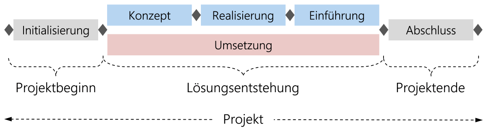
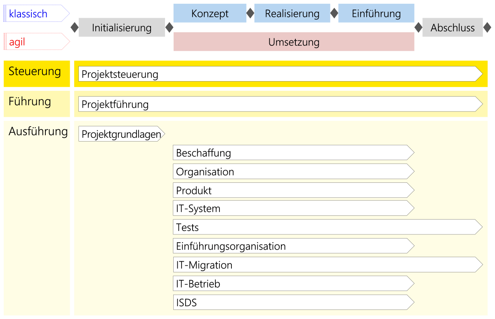
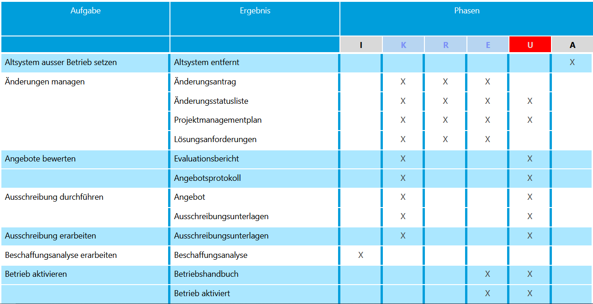
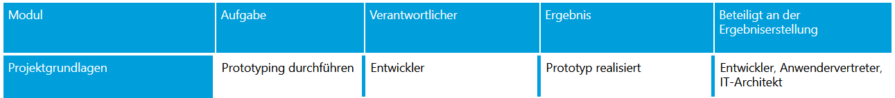
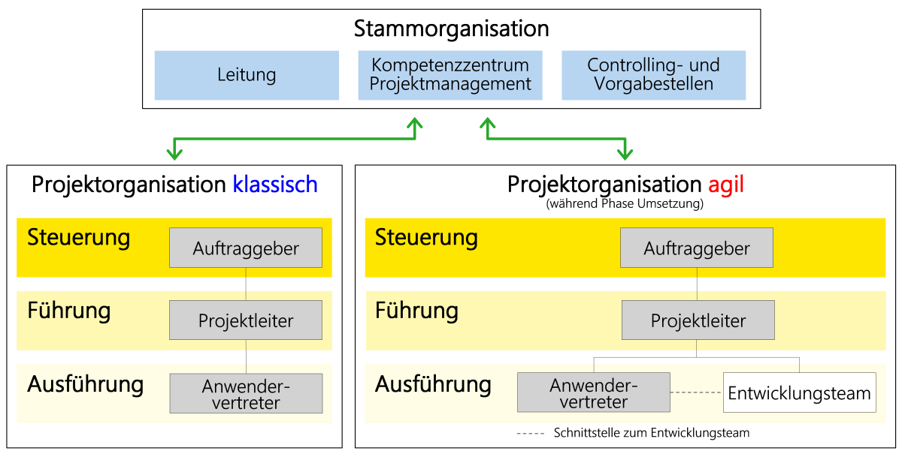

# Hermes

## Was ist Hermes?
Die Projektmanagementmethode "Hermes" ist eine Schweizer Projektmanagmentmethode, die in der öffentlichen Verwaltung sowie in anderen Branchen angewendet werden kann. Der Name steht als Akronym für „Handbuch der Elektronischen Rechenzentren des Bundes, eine Methode zur Entwicklung von Systemen“. 

Sie wurde von der schweizerischen Bundesverwaltung 1975 entwickelt, steht als offener Standard frei zur Verfügung und ist als Standard eCH-0054 vom Verein eCH anerkannt.

Die Methode wird kontinuierlich verbessert und geupdated.
Der Bund bietet dazu Online sehr viele Informationen an:

https://www.hermes.admin.ch/

---

Die Methode besteht aus einem umfassenden Handbuch, das verschiedene Aspekte des Projektmanagements abdeckt. Zu den wichtigsten Merkmalen von Hermes gehören: 

1.  **Strukturierte Phasen:**

    Hermes teilt das Projekt in Phasen ein, die von der Initialisierung bis zur Umsetzung reichen. Jede Phase wird sorgfältig geplant und dokumentiert, um sicherzustellen, dass das Projekt erfolgreich abgeschlossen wird. Die neuste Hermes Variante unterstützt Phasen für die agile Projektführung, wie auch die klassische Variante.

    

    Innerhalb der einzelnen Phasen werden Module eingesetzt, welche einzelne Teilschritte des Projekts darstellen. Phasen stellen den Projektfortschritt dar. Einzelne Module (wie zb. das Standardmodul [Projektführung](https://www.hermes.admin.ch/de/pjm-2022/verstehen/module/projektfuehrung.html)) können dabei in mehreren Phasen auftreten.

2. **Module:**

    Module enthalten thematisch zusammengehörende Aufgaben und Ergebnisse. Sie sind Bausteine zur Erstellung von Projekten und Szenarien. Das Modul Projektführung enthaltet zum Beispiel die Aufgabe 
    [Qualitätssicherung führen](https://www.hermes.admin.ch/de/pjm-2022/verstehen/aufgaben/qualitaetssicherung-fuehren.html). Aufgaben werden im nächsten Punkt genauer beschrieben. Diese Aufgaben führen immer zu Ergebnissen.

    
    
    Hermes biete eine Vielzahl von Standardmodulen, welche individuell angepasst werden können, oder sogar durch komplett eigene Module ersetzt werden können.

3. **Aufgaben & Ergebnisse:**

    Aufgaben sind bestimmten Rollen zugeteilt und werden immer mit Ergebnissen in Verbindung gebracht. Eine Aufgabe kann mehrere Aktivitäten beinhalten. Aufgaben dienen zur Bündelung in logische Schritte, aus einzelnen Aktivitäten wie zb. *Altsystem oder alte Systemversion ausser Betrieb setzen.* 
    
    Verbindet man diese Aktivität nun mit der Aktivität *Altsystem abbauen.*, ergibt dies die **Aufgabe** *Altsystem ausser Betrieb setzen*, mit dem Ergebniss *Altsystem entfernt*

    

    Ergebnisse sind entweder neue Zustände der Situation, wie im vorherigen Beispiel, oder aber Dokumente, welche vorrausgehend mit einer Vorlage definiert worden sind.

    Diese Dokumente sind zb. Testprotokolle, ein Durchführungsauftrag, eine Studie, eine Checkliste oder eine Prozessbeschreibung. Diese Liste ist nicht abschliessend.

4. **Rollen und Verantwortlichkeiten:** 

    Hermes definiert klare Rollen und Verantwortlichkeiten für alle Projektbeteiligten, einschließlich des Projektmanagers, des Projektteams und der Stakeholder. 

    Jede Aufgabe hat einen Verantwortlichen, mit einer spezifischen Rolle. Dieser Verantwortliche ist dafür zuständig, dass die definierten Ergebnisse erreicht werden. Dazu können aber auch noch andere Rollen miteinbezogen werden, sodass eine bestimmte Aufgabe von mehreren Rollen bearbeitet werden kann.

    

    Hier zum Beispiel sieht man gut, dass der Entwickler dafür verantwortlich ist, dass ein Prototyp realisiert wird. Für diese Aufgabe muss aber der IT-Architekt und der Anwendervertreter miteinbezogen werden, da diese massgeblich dazu beitragen müssen, dass der Prototyp in die jetzige IT-Architektur eingebunden wird (falls möglich) und von den Anwendern geforderte Anforderungen korrekt umgesetzt werden.

    Die einzelnen Rollen werden in einem hierarchischen Rollenmodell definiert. Dieses Modell ist nicht relevant für die Aufgaben / Module, bietet aber eine Übersicht.

    

    Die Unterteilung in Stammorganisation und Projektorganisation dient der Visualisierung der effektiven Abtrennung des Projekts von der Unternehmerischen Führung. Verbindungspunkte bestehen und Unternehmungsführungspersonen können auch direkt als Stakeholder in das Projekt eingegliedert werden.

## Was kann Hermes?

### Vorteile / Nachteile

### Einsatzzweck von Hermes
		
### Wie geht man mit Hermes vor?
		
### Praxisbeispiel

## Abschluss
